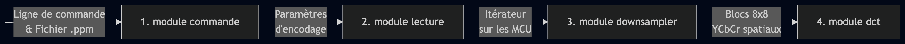

# État de l'encodeur JPEG

[Tableau de bord](https://formationc.pages.ensimag.fr/projet/jpeg/2026/2_bahag_becharam_bottnerp)

# Diagramme de Gantt

# Structures de données utilisées

# Enchaînement du pipeline (Flux de données)

Dans cette partie, nous présentons un résumé de notre découpage modulaire et l'enchaînement de l'encodage de l'image source jusqu'au résultat final (l'image compressée au format JPEG).

-   **1) Parsing de la commande d'exécution (module `commande`) :**
    -   *Entrée :* Toute la chaîne de la ligne de commande.
    -   *Sortie :* Tous les paramètres importants pour l'encodage (fichier d'entrée et de sortie, facteurs d'échantillonnage).
-   **2) Lecture du fichier (module `lecture`) :**
    -   *Entrée :* Les paramètres nécessaires (fichier d'entrée et facteurs d'échantillonnage).
    -   *Sortie :* Un itérateur sur les MCU de l'image avec la dimension voulue.
-   **3) Découpage en blocs 8x8 YCbCr (module `downsampler`) :**
    -   *Entrée :* Une MCU RGB ou en niveaux de gris, et les facteurs d'échantillonnage.
    -   *Sortie :* La décomposition de la MCU en blocs 8x8 convertis en YCbCr.
-   **4) Calcul de la DCT (module `dct`) :**
    -   *Entrée :* Un bloc 8x8 spatial d'une composante donnée (Y, Cb ou Cr).
    -   *Sortie :* Un bloc 8x8 fréquentiel.
-   **5) Quantification et ordonnancement Zigzag (module `zigzag_quantification`) :**
    -   *Entrée :* Un bloc fréquentiel 8x8 d'une composante donnée.
    -   *Sortie :* Un vecteur de taille 64 quantifié et réordonné sous forme de zigzag.
-   **6) Encodage des valeurs (modules `magnitude`, `rle` et `huffman`) :**
    -   *Entrée :* Un vecteur de taille 64 quantifié et ordonné en zigzag.
    -   *Sortie :* Le bloc entièrement encodé (bitstream).
-   **7) Écriture dans le fichier de sortie (modules `ecriture_entete` et `ecriture`) :**
    -   *Entrée :* Les informations essentielles pour l'en-tête (tables de Huffman, facteurs d'échantillonnage) et les blocs encodés.
    -   *Sortie :* Une image compressée valide au format `.jpg`.

**Schéma récapitulatif :**

# Notre encodeur JPEG à nous

Bienvenue sur la page d'accueil de *votre* projet JPEG, un grand espace de liberté, sous le regard bienveillant de vos enseignants préférés. Le sujet sera disponible dès lundi à l'adresse suivante : <https://formationc.pages.ensimag.fr/projet/jpeg/jpeg/>.

Vous pouvez reprendre cette page d'accueil comme bon vous semble, mais elle devra au moins comporter les infos suivantes **avant la fin de la première semaine** :

1.  des informations sur le découpage des fonctionnalités du projet en modules, en spécifiant les données en entrée et sortie de chaque étape ;
2.  (au moins) un dessin des structures de données de votre projet (format libre, ça peut être une photo d'un dessin manuscrit par exemple) ;
3.  une répartition des tâches au sein de votre équipe de développement, comportant une estimation du temps consacré à chacune d'elle (là encore, format libre, du truc cracra fait à la main, au joli Gantt chart).

Rajouter **régulièrement** des informations sur l'avancement de votre projet est aussi **une très bonne idée** (prendre 10 min tous les trois chaque matin pour résumer ce qui a été fait la veille, établir un plan d'action pour la journée qui commence et reporter tout ça ici, par exemple).

# Proposition de CI pour les élèves

## Makefile

-   Gère la génération de code : exécutable, debug et tests
-   Inclusion de sanitize par défaut (au détriment de Valgrind)
-   Gère la couverture de code
-   Intègre une cible pour lancer les tests en local
-   Intègre une cible perf pour faire de l'analyse de performance

## Unity pour faire des tests unitaires

-   Fonctionnement simplifié à l'extrême et ultra portable
-   [Le guide de démarrage](https://github.com/ThrowTheSwitch/Unity/blob/master/docs/UnityGettingStartedGuide.md)
-   [La liste des assertions possibles](https://github.com/ThrowTheSwitch/Unity/blob/master/docs/UnityAssertionsReference.md)
-   exemples fournis dans tests/test\_\*.c : à vous d'en ajouter et de les complèter

## Pytest pour faire les tests d'intégrations

### Pourquoi ?

Pytest, c'est un des framework de test python les plus utilisés.

### Où

`tests/test_all.py`

### Contenu

-   Intégration des tests unity pour avoir un résumé de tests uniformes

-   Vérification fonctionnelle organisée en catégorie ("cli","gris","couleur"..) pour vérifier que le programme fonctionne et produit un fichier comme il devrait en validant la qualité d'image générée selon 3 métriques

    -   SSIM : une métrique de proximité Comparaison réalisée par rapport à l'outil convert
    -   PAE : une métrique (erreur absolu pic) pour détecter les pixels foireux
    -   AE : une métrique complémentaire pour détecter les images foireuses (plus de 2% de pixels à plus de 10% de l'original). Pour info, `convert` reste en dessous de 0,1% sur cette métrique !

-   test de performance sur les images "couleur" via callgrind et normalisation selon la métrique (instructions/pixel). C'est une métrique imparfaite qui ne capturé ni l'ILP du processeur ni les défauts de cache. Mais dans un parc info hétérogène (intra-Ensimag et PC étudiant), le temps n'est pas une métrique de comparaison fiable. Inst/pixel est indépendant de la machine et invariant selon l'image.

-   Test sur la mémoire : pile, tas, sections importantes et RSS

### Fonctionnalités

-   Génération d'une synthèse dans le terminal
-   Génération d'un xml pour une intégration dans la CI gitlab

## CI Gitlab

-   Pipeline à 4 étages :
    -   étage de compilation
    -   étage de vérif rapide (tests unitaires et CLI) pour éviter les tests inutiles
    -   étage d'évaluation pour faire :
        -   les tests d'intégration
        -   la couverture de code
        -   l'évaluation de performance
        -   l'évaluation mémoire
    -   étage de déploiement pour faire la page de résultats
-   Syntèse des tests : visible depuis build:jobs ou en cliquant sur le résultat du job
-   Intégration de la couverture de code :
    -   Résumé et suivi visible dans build:jobs
    -   Badge utilisable dans le README : 
    -   Page de couverture consultable dans depuis le tableau de bord
-   Génération d'un [tableau de bord incluant les stats(qualité, performance) par scénario, les infos mémoires, un lien vers les rapports et le profilage de Biiiiiiig](https://formationc.pages.ensimag.fr/projet/jpeg/2026/2_bahag_becharam_bottnerp)

# Liens utiles

-   Bien former ses messages de commits : <https://www.conventionalcommits.org/en/v1.0.0/> ;
-   Besoin de prendre l'air ? Le [Mont Rachais](https://fr.wikipedia.org/wiki/Mont_Rachais) est accessible à pieds depuis la salle E301 !
-   Un peu juste sur le projet à quelques heures de la deadline ? Le [Montrachet](https://www.vinatis.com/achat-vin-puligny-montrachet) peut faire passer l'envie à vos profs de vous mettre une tôle !
